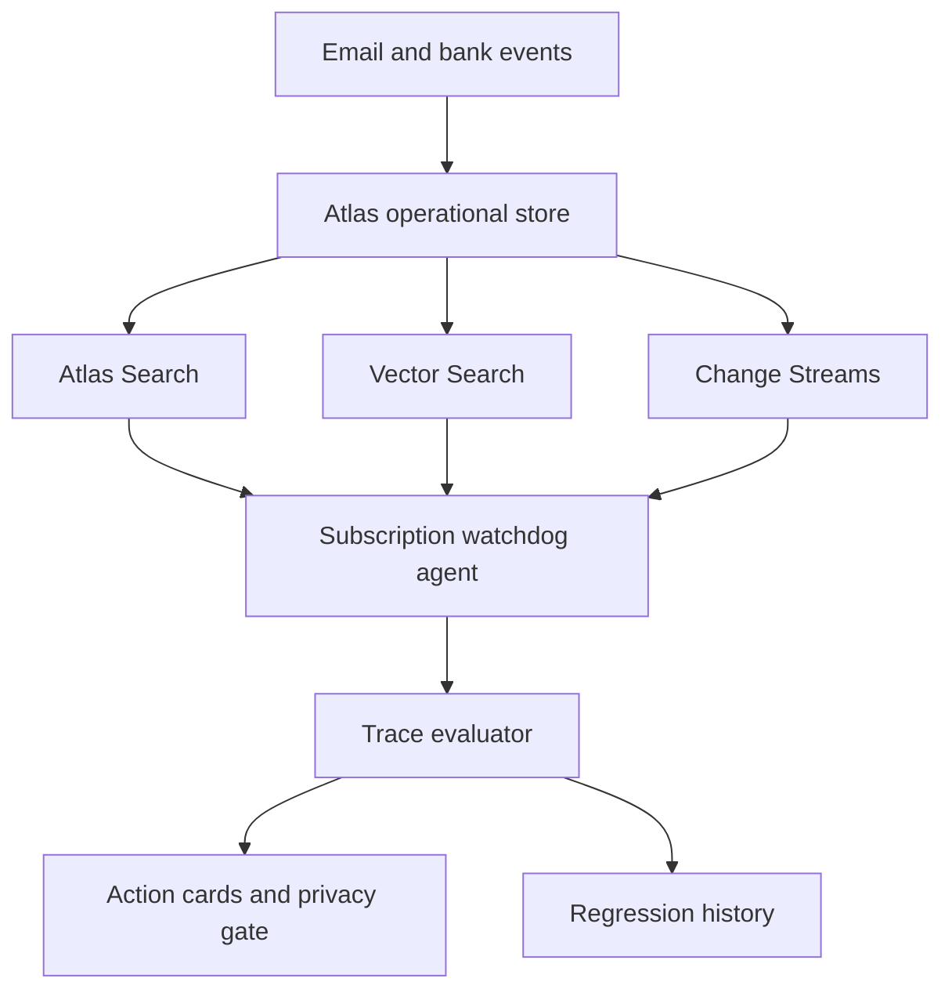
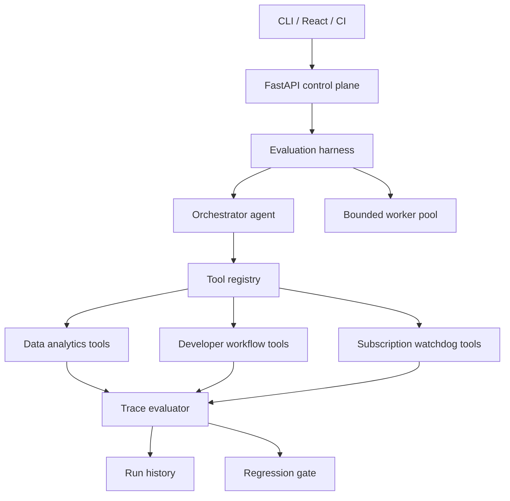
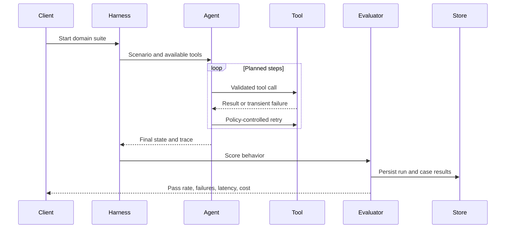
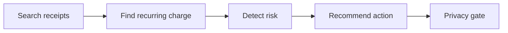
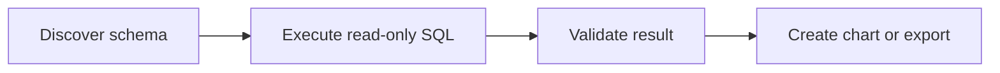
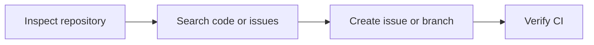

# ToolReliability

**A trace-driven orchestration and evaluation harness for tool-using AI agents.**

ToolReliability catches behavioral regressions caused by model, prompt, workflow, or tool changes. It executes domain-specific agent workflows, records every tool attempt, scores the resulting trace, persists run history, and exposes results through an API, CLI, dashboard, and CI quality gate.

For the MongoDB hackathon, the flagship demo is **SubShield AI**, an autonomous subscription and privacy watchdog that detects subscription dark patterns, duplicate billing, price hikes, promotional-pricing expiry, and unsafe AI-to-human delegation before personal data is shared externally.

     

## Why it exists

Traditional unit tests verify deterministic functions. Tool-using agents are harder to validate: a harmless-looking prompt or model update can select the wrong tool, omit an argument, execute steps in the wrong order, retry a side effect twice, or claim success after a failed operation.

ToolReliability treats the complete execution trace as the testable artifact. It evaluates what the agent did, not only what it said, and turns those results into a release decision.

## MongoDB hackathon demo: SubShield AI

Subscription dark patterns are still a real consumer problem: confusing recurring billing, hidden price increases, duplicate subscriptions, promotional rates that quietly expire, and cancellation flows that push users into high-friction support channels.

SubShield AI reframes ToolReliability as a consumer agent that can safely watch bills and take action:

- Detect a Canva monthly price increase from `$12` to `$16`.
- Detect duplicate subscriptions across email receipts and transactions.
- Flag internet promotional pricing before the bill jumps.
- Recommend `keep`, `downgrade`, `negotiate`, or `cancel`.
- Before delegating cancellation or negotiation, scan the payload for sensitive data.
- Redact unnecessary fields such as home address, medical reason, or bank details.
- Produce an auditable trace so regressions are caught before the agent acts.

### MongoDB-native architecture



| MongoDB capability | Hackathon use |
|---|---|
| Atlas document store | User subscriptions, transactions, receipts, consent logs, and agent traces |
| Atlas Search | Search receipts, renewal emails, cancellation terms, and vendor policies |
| Vector Search | Match similar subscriptions, vendor aliases, cancellation patterns, and prior user actions |
| Change Streams | Trigger an evaluation when a new receipt, transaction, or renewal notice arrives |
| Time series collections | Track monthly price changes and renewal cadence over time |
| Aggregation pipelines | Compute spend, duplicate billing, price deltas, and upcoming renewal risk |

## Architecture



### Evaluation lifecycle



## Implemented features

### Orchestration and execution

- Domain-independent `EvaluationHarness`
- Traceable planner/executor loop through `OrchestratorAgent`
- Bounded asynchronous concurrency using semaphores
- Per-case execution timeout
- Configurable maximum attempts
- Retry classification for timeouts, rate limits, and connection resets
- Immediate stop for non-retryable failures
- Replaceable planner boundary for future model-backed agents

### Tool runtime

- Central registry containing tool ownership, descriptions, required arguments, and side-effect metadata
- Required-argument validation before execution
- Isolated deterministic environments for repeatable evaluation
- Side-effect protection against duplicate issue, branch, refund, and unsafe delegation operations
- Fault injection for timeout and rate-limit recovery tests
- Read-only SQL enforcement in the analytics environment
- Privacy redaction gate for subscription cancellation and negotiation delegation

### Trace and evaluation

Every tool attempt records the tool name, arguments, attempt number, response, error category, success status, and execution latency.

| Metric | What it measures |
|---|---|
| Tool-selection F1 | Required tools selected without unnecessary tools |
| Argument accuracy | Tool inputs match expected values |
| Sequence score | Successful calls follow the required order |
| Task completion | Expected environment state is reached |
| Efficiency | Agent avoids unnecessary calls and retries |
| Overall score | Weighted release score across all dimensions |

Critical failures, including forbidden tool calls, override the aggregate score.

## Evaluation packs

### Subscription watchdog

The subscription pack is the MongoDB hackathon track. It verifies that an agent can move from messy consumer evidence to a safe, auditable recommendation.



Covered behaviors:

- Hidden price increase detection
- Recurring transaction lookup
- Duplicate subscription detection support in the tool registry
- Promotional-pricing expiry support in the tool registry
- Keep, downgrade, negotiate, and cancel recommendation cards
- Privacy scan before cancellation or negotiation delegation
- Redaction before any external handoff
- Forbidden raw delegation checks

### Data analytics

The analytics pack verifies that an agent can safely move from a business question to a validated artifact.



Covered behaviors include table discovery, read-only query enforcement, result validation, chart generation, CSV export, and warehouse-timeout recovery.

### Developer workflow

The developer pack evaluates multi-step repository operations with controlled side effects.



Covered behaviors include repository discovery, code search, duplicate issue prevention, branch creation, CI verification, and rate-limit recovery.

## API

| Method | Endpoint | Purpose |
|---|---|---|
| `GET` | `/health` | Service health |
| `GET` | `/api/tools` | Registered tools and metadata |
| `GET` | `/api/suites` | Available domain suites |
| `POST` | `/api/harness/runs?domain=subscription_watchdog` | Execute the MongoDB hackathon subscription suite |
| `POST` | `/api/harness/runs?domain=data_analytics` | Execute the analytics suite |
| `POST` | `/api/harness/runs?domain=developer_workflow` | Execute the developer suite |
| `GET` | `/api/harness/runs` | List persisted runs |
| `GET` | `/api/harness/runs/{run_id}` | Retrieve a complete run |

Interactive OpenAPI documentation is available at `http://localhost:8000/docs`.

## Quick start

```bash
python3 -m venv .venv
source .venv/bin/activate
pip install -e '.[dev]'
pytest -q
```

Run the MongoDB hackathon demo domain:

```bash
toolreliability --domain subscription_watchdog --minimum-pass-rate 0.90
```

Run the other domains:

```bash
toolreliability --domain data_analytics
toolreliability --domain developer_workflow
```

Start the API and dashboard:

```bash
uvicorn toolreliability.api:app --reload
```

```bash
cd frontend
npm install
npm run dev
```

Open `http://localhost:5173`, or launch the stack with:

```bash
docker compose up --build
```

## Demo script

1. Start with the consumer pain: recurring subscriptions continue charging because renewal emails, bank transactions, and cancellation terms are scattered.
2. Run `toolreliability --domain subscription_watchdog`.
3. Show the Canva scenario: the agent searches receipts, finds the recurring charge, compares old and new prices, and recommends downgrade.
4. Show the privacy scenario: the agent plans a gym cancellation, scans the delegation payload, redacts home address and medical reason, and only prepares a safe vendor request.
5. Explain how MongoDB Atlas stores receipts, transactions, consent logs, traces, and baseline runs, while Atlas Search and Vector Search retrieve relevant evidence.
6. Close with the regression angle: if a future model skips redaction or sends a raw request, the quality gate fails before the action reaches the vendor.

## Add another agent

The harness is framework-independent. Implement the adapter contract and return a structured trace:

```python
class MyAgent:
    name = "my-agent-v2"

    async def run(self, scenario, environment) -> AgentResult:
        # Invoke LangGraph, MCP, vLLM, Bedrock,
        # or another hosted agent endpoint.
        ...
```

A model-backed planner can replace the reference orchestrator while preserving concurrency control, retries, tool validation, trace evaluation, persistence, and CI thresholds.

## Repository structure

```text
toolreliability/
├── toolreliability/
│   ├── api.py            # FastAPI control plane
│   ├── orchestrator.py   # Agent loop and evaluation harness
│   ├── domain_tools.py   # Tool registry and environments
│   ├── evaluator.py      # Trace scoring
│   ├── storage.py        # Persistent run history
│   └── models.py         # Typed contracts
├── scenarios/
│   ├── subscription_watchdog.yaml
│   ├── data_analytics.yaml
│   └── developer_workflow.yaml
├── frontend/             # React dashboard
├── tests/                # API, evaluator, and harness tests
├── Dockerfile
└── docker-compose.yml
```

## CI regression gate

GitHub Actions runs tests and the CLI quality gate on pushes and pull requests. The CLI returns a non-zero exit code when the pass rate falls below the configured threshold and uploads the complete JSON report as a workflow artifact.

```bash
toolreliability \
  --domain subscription_watchdog \
  --minimum-pass-rate 0.90 \
  --output evaluation-report.json
```

## Production roadmap

- MongoDB Atlas persistence for subscriptions, traces, and consent logs
- Atlas Search over receipts, policies, and cancellation terms
- Vector Search for duplicate subscription matching and vendor-pattern retrieval
- Change Streams for transaction and renewal-event triggers
- MCP and OpenAPI automatic tool discovery
- Baseline/candidate comparisons and slice-level regression policies
- Production trace replay with sensitive-data redaction
- OpenTelemetry traces, Prometheus metrics, and Grafana dashboards
- Hosted-model, Bedrock, vLLM, and LangGraph adapters
- Kubernetes deployment and provider-aware concurrency controls

## License

MIT
