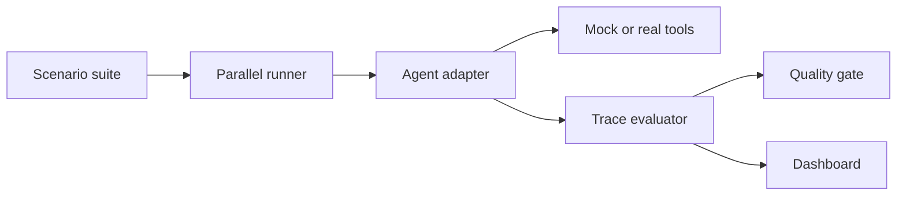

# ToolReliability

**A trace-driven orchestration and evaluation harness for tool-using AI agents.** ToolReliability detects silent regressions when a model, prompt, tool definition, or external API changes.

   

## Why it exists

Normal unit tests cannot fully validate nondeterministic agents. A prompt change can make an agent select the wrong tool, omit an argument, call tools out of order, or retry a side effect twice. This project evaluates the complete execution trace and turns agent quality into a CI release gate.

## Features

- Structured YAML evaluation scenarios
- Tool-selection F1, argument accuracy, sequence, final-state and efficiency scoring
- Deterministic mock commerce environment with side effects
- Timeout and failure injection with retry evaluation
- Pluggable `AgentAdapter` interface for LangGraph, MCP, hosted models or vLLM
- Parallel asynchronous evaluation runner
- FastAPI endpoints and interactive React dashboard
- Deliberately regressed agent for demonstrating failure detection
- Docker Compose and GitHub Actions quality gate
- Domain-independent orchestrator with bounded parallel execution and retry policies
- Durable evaluation history through a storage abstraction
- Data-analytics pack for SQL, validation, charts and exports
- Developer-workflow pack for repositories, issues, branches and CI

## Architecture



## Quick start

```bash
python3 -m venv .venv
source .venv/bin/activate
pip install -e '.[dev]'
pytest -q
toolreliability --agent reference
toolreliability --domain data_analytics
toolreliability --domain developer_workflow
uvicorn toolreliability.api:app --reload
```

In another terminal:

```bash
cd frontend
npm install
npm run dev
```

Open `http://localhost:5173`. API documentation is at `http://localhost:8000/docs`.

Or launch both services:

```bash
docker compose up --build
```

## Demonstrate a caught regression

```bash
toolreliability --agent regression --minimum-pass-rate 0.85
```

The regression agent skips refund eligibility checks. The command exits non-zero and identifies the affected scenarios, matching how the GitHub Actions quality gate protects a deployment.

## Add a real agent

Implement the small adapter contract in `toolreliability/agents.py`:

```python
class MyAgent:
    name = "my-agent-v2"

    async def run(self, scenario, environment) -> AgentResult:
        # Call your LangGraph agent, MCP client, vLLM or hosted endpoint.
        # Record every tool call and return the final state.
        ...
```

The evaluation system is deliberately framework-independent.

## Orchestrator harness

The orchestrator separates planning from execution policy. A model-backed planner can replace the reference planner without changing bounded concurrency, retry classification, tool validation, trace recording, final-state evaluation or persistence. Every tool attempt records arguments, response, latency, error and attempt number.

```bash
curl -X POST 'http://localhost:8000/api/harness/runs?domain=data_analytics'
curl -X POST 'http://localhost:8000/api/harness/runs?domain=developer_workflow'
curl 'http://localhost:8000/api/harness/runs'
```

### Data analytics workflow

Schema discovery → read-only SQL execution → result validation → chart or export. The harness evaluates order, arguments, final state, retry behavior and forbidden operations.

### Developer workflow

Repository inspection → code or issue search → controlled issue/branch mutation → CI verification. Side-effecting tools reject duplicates, while transient CI failures exercise retry policy.

## Roadmap

- MCP and OpenAPI automatic tool discovery
- Production trace replay and PII redaction
- PostgreSQL run history and baseline comparisons
- OpenTelemetry spans and Grafana dashboards
- LLM-as-judge for semantic fields, alongside deterministic evaluators
- Kubernetes workers and provider-aware concurrency controls

## License

MIT
