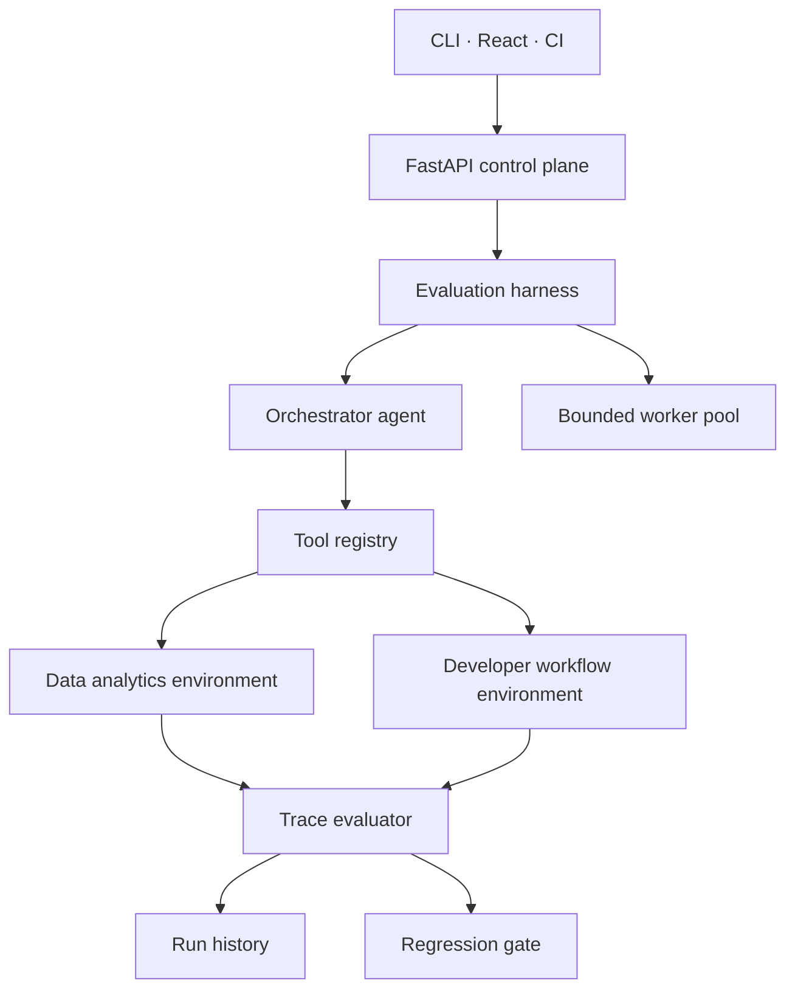
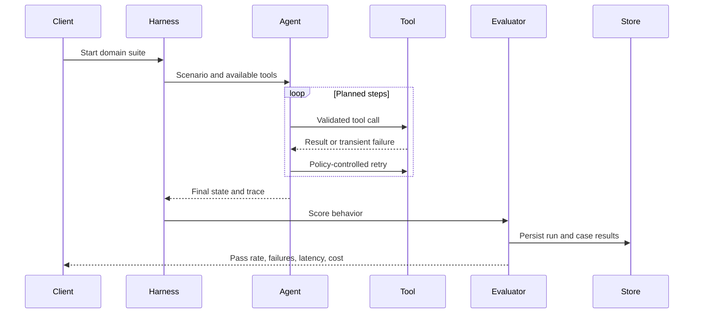
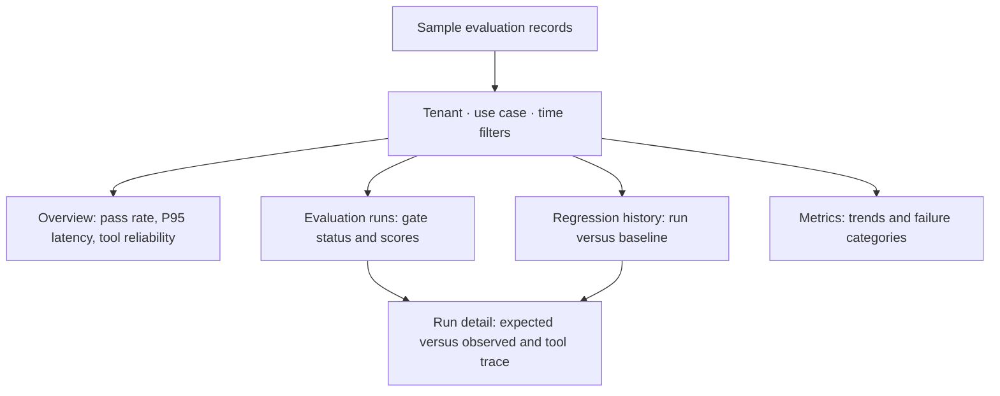
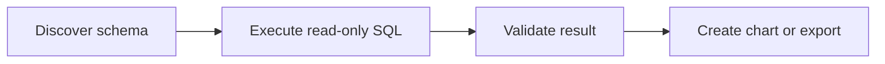
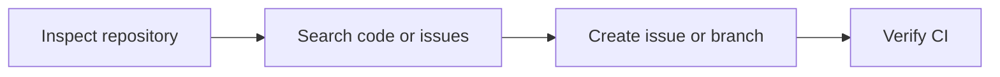

# ToolReliability

**A trace-driven orchestration and evaluation harness for tool-using AI agents.**

ToolReliability catches behavioral regressions caused by model, prompt, workflow, or tool changes. It executes domain-specific agent workflows, records every tool attempt, scores the resulting trace, persists run history, and exposes results through an API, CLI, dashboard, and CI quality gate.

    

## Why it exists

Traditional unit tests verify deterministic functions. Tool-using agents are harder to validate: a harmless-looking prompt or model update can select the wrong tool, omit an argument, execute steps in the wrong order, retry a side effect twice, or claim success after a failed operation.

ToolReliability treats the complete execution trace as the testable artifact. It evaluates what the agent did—not only what it said—and turns those results into a release decision.

## Architecture



### Evaluation lifecycle



### Console prototype (sample data)

The separate console prototype presents fictional tenant and evaluation records. Its filters and drill-downs illustrate the intended experience; they are not connected to this repository's API or persisted run history.



## Implemented features

### Orchestration and execution

- Domain-independent `EvaluationHarness`
- Traceable planner/executor loop through `OrchestratorAgent`
- Bounded asynchronous concurrency using semaphores
- Per-case execution timeout
- Configurable maximum attempts
- Retry classification for timeouts, rate limits, and connection resets
- Immediate stop for non-retryable failures
- Replaceable planner boundary for future model-backed agents

### Tool runtime

- Central registry containing tool ownership, descriptions, required arguments, and side-effect metadata
- Required-argument validation before execution
- Isolated deterministic environments for repeatable evaluation
- Side-effect protection against duplicate issue, branch, and refund operations
- Fault injection for timeout and rate-limit recovery tests
- Read-only SQL enforcement in the analytics environment

### Trace and evaluation

Every tool attempt records the tool name, arguments, attempt number, response, error category, success status, and execution latency.

| Metric | What it measures |
|---|---|
| Tool-selection F1 | Required tools selected without unnecessary tools |
| Argument accuracy | Tool inputs match expected values |
| Sequence score | Successful calls follow the required order |
| Task completion | Expected environment state is reached |
| Efficiency | Agent avoids unnecessary calls and retries |
| Overall score | Weighted release score across all dimensions |

Critical failures, including forbidden tool calls, override the aggregate score.

### Persistence and interfaces

- Durable SQLite run history behind a replaceable `RunStore` boundary
- Run summaries, domain metadata, traces, latency, cost, and scores
- FastAPI endpoints for suite discovery, execution, history, and individual runs
- CLI execution for local development and CI
- React dashboard for domain selection and scenario-level results
- Docker Compose deployment with a persistent data volume
- GitHub Actions regression gate and evaluation report artifact

## Evaluation packs

### Data analytics

The analytics pack verifies that an agent can safely move from a business question to a validated artifact.



Covered behaviors:

- Table and column discovery
- Read-only query enforcement
- Aggregation and filtering queries
- Result ID propagation between tools
- Result validation before downstream actions
- Bar-chart generation and CSV export
- Warehouse-timeout retry and recovery
- Forbidden chart/export operations

### Developer workflow

The developer pack evaluates multi-step repository operations with controlled side effects.



Covered behaviors:

- Repository and default-branch discovery
- Code search before issue creation
- Existing-issue search and duplicate prevention
- Branch creation from an explicit base
- CI status verification
- Rate-limit retry and recovery
- Forbidden issue or branch operations

Evaluation packs are YAML-defined, so additional domains can reuse the same orchestration and evaluation runtime.

## API

| Method | Endpoint | Purpose |
|---|---|---|
| `GET` | `/health` | Service health |
| `GET` | `/api/tools` | Registered tools and metadata |
| `GET` | `/api/suites` | Available domain suites |
| `POST` | `/api/harness/runs?domain=data_analytics` | Execute the analytics suite |
| `POST` | `/api/harness/runs?domain=developer_workflow` | Execute the developer suite |
| `GET` | `/api/harness/runs` | List persisted runs |
| `GET` | `/api/harness/runs/{run_id}` | Retrieve a complete run |

Interactive OpenAPI documentation is available at `http://localhost:8000/docs`.

## Quick start

```bash
python3 -m venv .venv
source .venv/bin/activate
pip install -e '.[dev]'
pytest -q
```

Run either domain:

```bash
toolreliability --domain data_analytics
toolreliability --domain developer_workflow
```

Start the API and dashboard:

```bash
uvicorn toolreliability.api:app --reload
```

```bash
cd frontend
npm install
npm run dev
```

Open `http://localhost:5173`, or launch the stack with:

```bash
docker compose up --build
```

## Add another agent

The harness is framework-independent. Implement the adapter contract and return a structured trace:

```python
class MyAgent:
    name = "my-agent-v2"

    async def run(self, scenario, environment) -> AgentResult:
        # Invoke LangGraph, MCP, vLLM, Bedrock,
        # or another hosted agent endpoint.
        ...
```

A model-backed planner can replace the reference orchestrator while preserving concurrency control, retries, tool validation, trace evaluation, persistence, and CI thresholds.

## Repository structure

```text
toolreliability/
├── toolreliability/
│   ├── api.py            # FastAPI control plane
│   ├── orchestrator.py   # Agent loop and evaluation harness
│   ├── domain_tools.py   # Tool registry and environments
│   ├── evaluator.py      # Trace scoring
│   ├── storage.py        # Persistent run history
│   └── models.py         # Typed contracts
├── scenarios/
│   ├── data_analytics.yaml
│   └── developer_workflow.yaml
├── frontend/             # React dashboard
├── tests/                # API, evaluator, and harness tests
├── Dockerfile
└── docker-compose.yml
```

## CI regression gate

GitHub Actions runs tests and the CLI quality gate on pushes and pull requests. The CLI returns a non-zero exit code when the pass rate falls below the configured threshold and uploads the complete JSON report as a workflow artifact.

```bash
toolreliability \
  --domain data_analytics \
  --minimum-pass-rate 0.90 \
  --output evaluation-report.json
```

## Production roadmap

- MCP and OpenAPI automatic tool discovery
- PostgreSQL multi-tenant storage and migrations
- Redis-backed distributed workers and cancellation
- Production trace replay with sensitive-data redaction
- Baseline/candidate comparisons and slice-level regression policies
- OpenTelemetry traces, Prometheus metrics, and Grafana dashboards
- Hosted-model, Bedrock, vLLM, and LangGraph adapters
- Kubernetes deployment and provider-aware concurrency controls

## License

MIT
