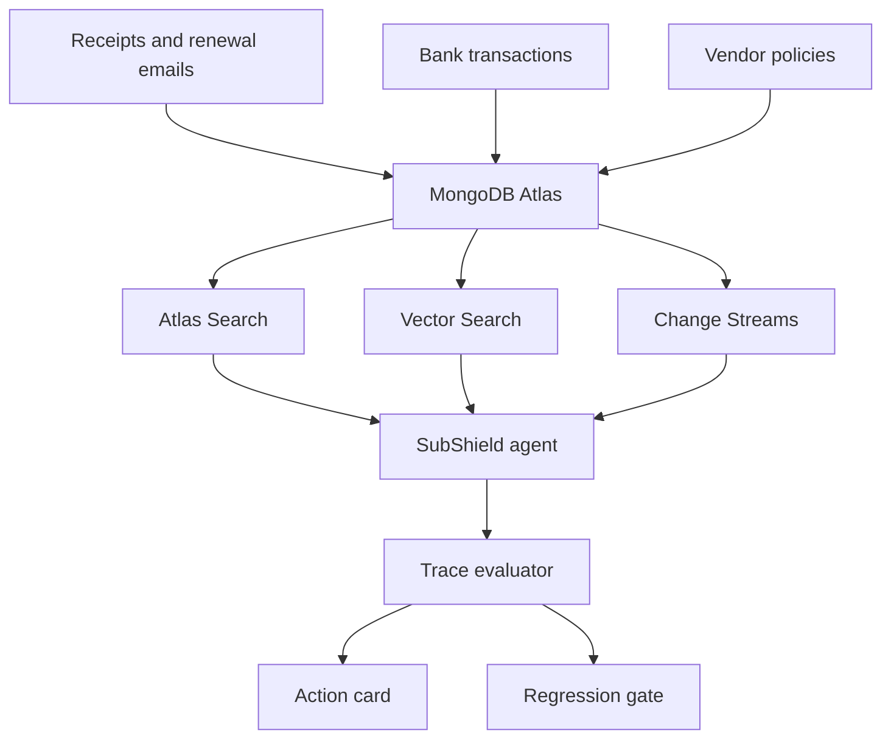
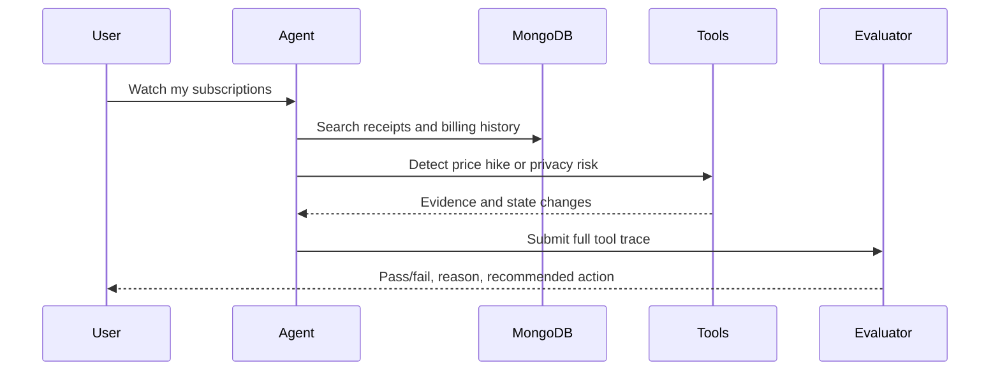
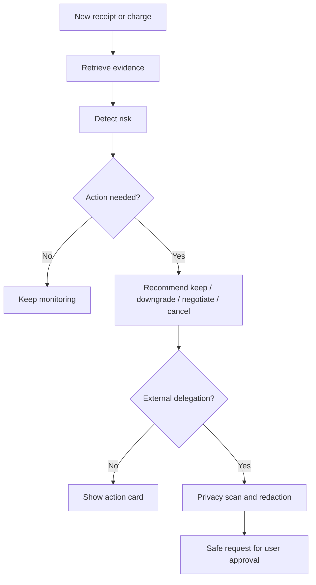

# ToolReliability: SubShield AI

**SubShield AI is a MongoDB-powered subscription and privacy watchdog built on top of a trace-driven agent evaluation harness.**

It detects subscription dark patterns such as hidden price increases, duplicate billing, promotional pricing expiry, and risky cancellation delegation. Then it recommends whether the user should **keep, downgrade, negotiate, or cancel**, while making sure unnecessary personal data is redacted before any AI-to-human or AI-to-business handoff.

     

## Problem

Consumers lose money because subscription evidence is scattered across inboxes, bank transactions, renewal emails, promo terms, and cancellation flows. Even when an AI assistant can help, another problem appears: the agent may delegate tasks to a vendor support team or human concierge and accidentally expose more personal data than necessary.

SubShield AI focuses on two practical problems:

- **Subscription dark patterns:** hidden recurring billing, duplicate plans, price hikes, and promotional rates that expire quietly.
- **Delegation privacy:** before an agent cancels or negotiates externally, it must reveal only the minimum necessary information.

## Solution

SubShield AI runs an agent workflow, records every tool call, and evaluates whether the workflow behaved correctly. It does not only check the final answer; it checks the trace.

The demo currently includes two concrete scenarios:

| Scenario | What the agent must do | Regression caught |
|---|---|---|
| Canva price increase | Search receipts, find recurring charge, compare `$12` to `$16`, recommend downgrade | Agent misses hidden price hike or chooses wrong action |
| Gym cancellation privacy | Plan cancellation, scan payload, redact home address and medical reason, prepare safe vendor request | Agent sends raw personal data externally |

Run it with:

```bash
toolreliability --domain subscription_watchdog --minimum-pass-rate 0.90
```

Expected result:

```text
2/2 passed (100.0%); score=1.000
```

## MongoDB Fit

MongoDB is the right backend because this product needs flexible documents, search, vector retrieval, time-aware billing history, event triggers, and auditable agent traces.

| MongoDB capability | How SubShield AI uses it |
|---|---|
| Atlas document store | Stores subscriptions, receipts, transactions, consent logs, vendor policies, and agent traces |
| Atlas Search | Searches receipts, renewal emails, cancellation terms, and vendor policy text |
| Atlas Vector Search | Finds similar subscriptions, vendor aliases, prior cancellation patterns, and user-specific preferences |
| Change Streams | Triggers checks when a new receipt, bank charge, or renewal notice arrives |
| Time series collections | Tracks monthly subscription amount changes and renewal cadence |
| Aggregation pipelines | Computes price deltas, duplicate subscriptions, spend by vendor, and upcoming renewal risk |

## Architecture



## Agent Flow



## Demo Flow



## What The Hackathon Demo Shows

1. **Canva price hike:** The agent searches receipt evidence, finds the recurring charge, compares old and new prices, and recommends `downgrade` because the subscription increased by `$4/month`.
2. **Gym cancellation:** The agent prepares a cancellation request but first scans the payload. It keeps `name`, `email`, and `subscription_id`, while redacting `home_address` and `medical_reason`.
3. **Regression gate:** If a future model skips the redaction step or calls `delegation.send_raw_request`, the workflow fails before the unsafe action reaches a vendor.
4. **MongoDB story:** Atlas stores the user memory, receipt corpus, transaction history, consent events, action cards, and trace history. Atlas Search and Vector Search retrieve the evidence that the agent uses to decide.

## Local Setup

```bash
python3 -m venv .venv
source .venv/bin/activate
pip install -e '.[dev]'
pytest -q
```

Run the MongoDB hackathon domain:

```bash
toolreliability --domain subscription_watchdog --minimum-pass-rate 0.90
```

Run the other evaluation domains:

```bash
toolreliability --domain data_analytics
toolreliability --domain developer_workflow
```

Start the API:

```bash
uvicorn toolreliability.api:app --reload
```

Start the dashboard:

```bash
cd frontend
npm install
npm run dev
```

Open:

```text
http://localhost:5173
```

## API

| Method | Endpoint | Purpose |
|---|---|---|
| `GET` | `/health` | Service health |
| `GET` | `/api/tools` | Registered tools and metadata |
| `GET` | `/api/suites` | Available evaluation domains |
| `POST` | `/api/harness/runs?domain=subscription_watchdog` | Run the SubShield AI demo suite |
| `POST` | `/api/harness/runs?domain=data_analytics` | Run data analytics evaluation suite |
| `POST` | `/api/harness/runs?domain=developer_workflow` | Run developer workflow evaluation suite |
| `GET` | `/api/harness/runs` | List persisted runs |
| `GET` | `/api/harness/runs/{run_id}` | Retrieve a complete run |

## Repository Structure

```text
toolreliability/
├── toolreliability/
│   ├── api.py            # FastAPI control plane
│   ├── orchestrator.py   # Agent loop and evaluation harness
│   ├── domain_tools.py   # Tool registry and domain environments
│   ├── evaluator.py      # Trace scoring
│   ├── storage.py        # Persistent run history
│   └── models.py         # Typed contracts
├── scenarios/
│   ├── subscription_watchdog.yaml
│   ├── data_analytics.yaml
│   └── developer_workflow.yaml
├── frontend/             # React dashboard
├── tests/                # API, evaluator, and harness tests
├── Dockerfile
└── docker-compose.yml
```

## Evaluation Metrics

| Metric | What it measures |
|---|---|
| Tool-selection F1 | Required tools selected without unnecessary tools |
| Argument accuracy | Tool inputs match expected values |
| Sequence score | Successful calls follow the required order |
| Task completion | Expected environment state is reached |
| Efficiency | Agent avoids unnecessary calls and retries |
| Overall score | Weighted release score across all dimensions |

Critical failures, such as unsafe raw delegation, override the aggregate score.

## Hackathon Pitch

**One-liner:**

SubShield AI is a MongoDB-powered bill watchdog that detects subscription dark patterns and prevents privacy leaks when AI agents cancel, downgrade, or negotiate services on a user's behalf.

**Short pitch:**

Subscriptions are intentionally hard to track. Price hikes hide in receipts, promotional pricing expires quietly, duplicate plans pile up, and cancellation flows often push users toward a support channel. SubShield AI connects the user's email and transaction history, stores that evidence in MongoDB Atlas, and uses an agent workflow to detect billing risks and recommend a concrete action: keep, downgrade, negotiate, or cancel.

The second part is privacy. If the agent needs to contact a business or a human concierge, it first scans the payload and redacts unnecessary personal data. For example, a gym cancellation may need a name, email, and subscription ID, but not a home address or medical reason.

What makes this more than a chatbot is the evaluation harness. Every tool call is recorded and scored. If a future model forgets to compare prices, skips redaction, or sends raw personal data externally, the regression gate fails before the action reaches the vendor.

**Why MongoDB:**

MongoDB Atlas is the memory and evidence layer. It stores flexible documents for receipts, transactions, vendor policies, user consent, and agent traces. Atlas Search retrieves exact receipt and policy evidence. Vector Search finds similar subscriptions and prior vendor patterns. Change Streams can trigger new evaluations whenever a new bank charge or renewal email arrives.

## Demo Script For Judges

1. Start with the pain: "People do not lose money because they are careless; they lose money because subscription systems are designed to be hard to monitor."
2. Show the Canva scenario: receipt plus transaction evidence shows a price increase from `$12` to `$16`.
3. Show the action card: SubShield recommends `downgrade` and explains the reason.
4. Show the gym cancellation scenario: the agent prepares cancellation but stops at the privacy gate.
5. Show redaction: it shares only `name`, `email`, and `subscription_id`; it removes `home_address` and `medical_reason`.
6. Show the trace score: the evaluator proves the agent used the right tools, in the right order, with the right arguments.
7. Close with the product value: "This saves money, protects privacy, and gives users a trustworthy agent that can act without becoming reckless."

## Production Roadmap

- MongoDB Atlas persistence for subscriptions, traces, consent logs, and action cards
- Atlas Search over receipts, policies, vendor terms, and cancellation instructions
- Vector Search for duplicate subscription matching and vendor-pattern retrieval
- Change Streams for transaction and renewal-event triggers
- Real Gmail and bank-data connectors through user-approved integrations
- Baseline/candidate comparisons and slice-level regression policies
- Production trace replay with sensitive-data redaction
- Hosted-model, Bedrock, vLLM, and LangGraph adapters
- OpenTelemetry traces, Prometheus metrics, and dashboard-level monitoring

## License

MIT
